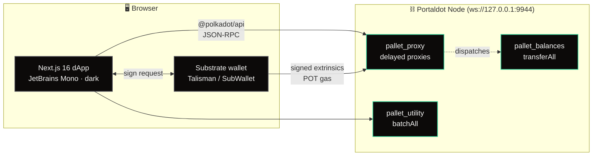
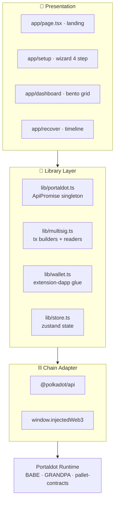
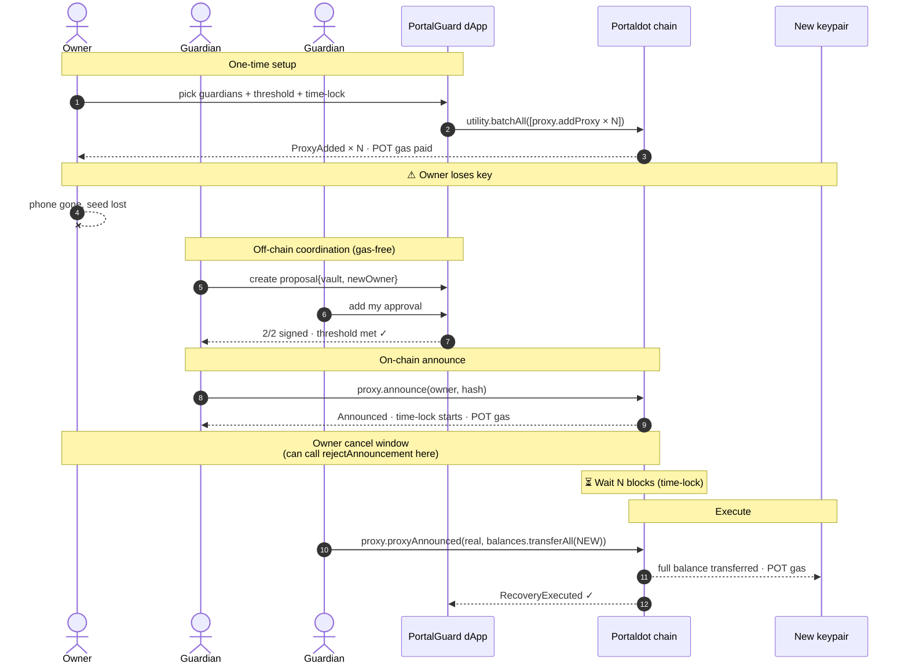
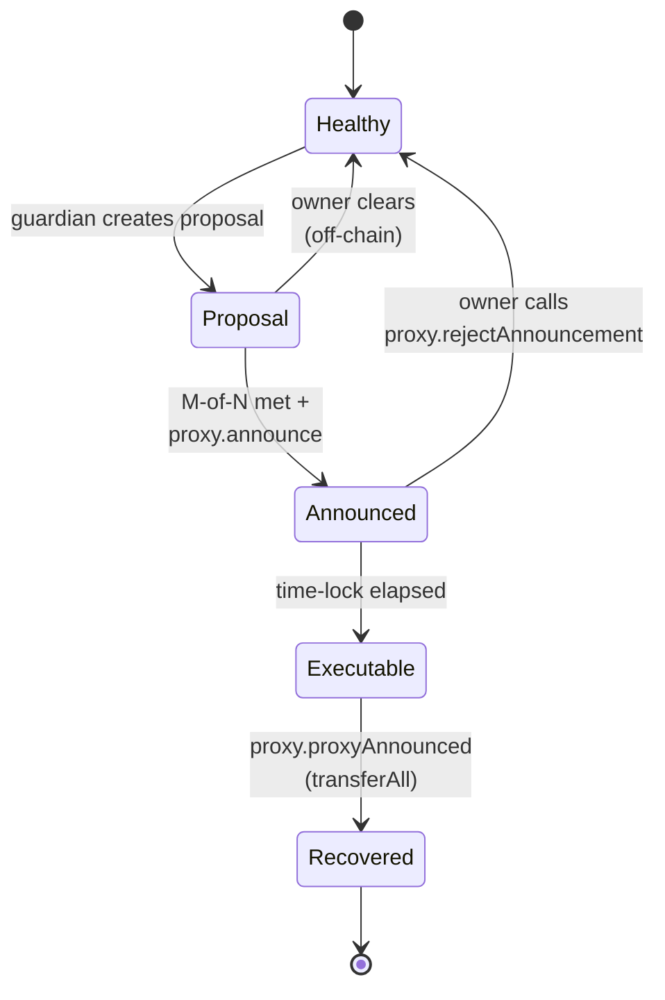
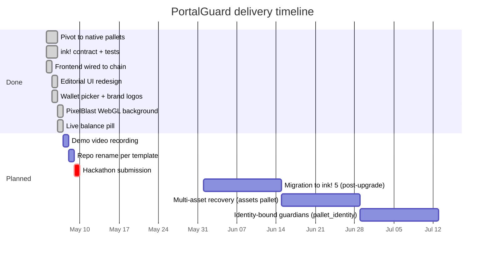

<div align="center">


# PortalGuard

### Lose your keys. Not your assets.

**Social-recovery wallet for Portaldot.** Trusted-friend account recovery, fully on-chain via native pallet primitives. POT used as gas. Submitted to **Portaldot Mini Hackathon Online S1** (April–May 2026).

[](LICENSE)
[](https://portaldot-dev.readthedocs.io/en/latest/)
[](https://nextjs.org/)
[](https://substrate.io/)

</div>

---

## ✦ Table of Contents

1. [Overview](#-overview)
2. [Why PortalGuard](#-why-portalguard)
3. [Architecture](#-architecture)
4. [Recovery Flow](#-recovery-flow)
5. [State Machine](#-state-machine)
6. [Tech Stack](#-tech-stack)
7. [Smart Contract](#-smart-contract-reference)
8. [Installation](#-installation)
9. [Run the Demo](#-run-the-demo)
10. [Screenshots](#-screenshots)
11. [Roadmap](#-roadmap)
12. [Team](#-team)
13. [License](#-license)

---

## ✧ Overview

### Problem

Self-custody wallets have a brutal cliff: **lose your private key, lose your assets forever**. Web2 has "Forgot password," Web3 doesn't — and that one missing primitive blocks tens of millions from comfortably holding crypto.

> 1 in 5 holders have lost access to crypto at least once.<br/>~20% of all Bitcoin supply is permanently lost.

### Solution

**PortalGuard** turns a guardian collective into a programmable recovery key for any Portaldot account.

| Concept | Implementation |
| ------- | -------------- |
| Guardian | A delayed proxy on the owner's account (`pallet_proxy`) |
| Threshold | Off-chain M-of-N coordination, enforced in the dApp UX |
| Time-lock | Block-level `delay` parameter on each proxy |
| Recovery announce | `proxy.announce(real, callHash)` |
| Recovery execute | `proxy.proxyAnnounced(...balances.transferAll)` |
| Cancel | `proxy.rejectAnnouncement(delegate, callHash)` |

**No custodian. No oracle. No new contract.** Every step is a real Portaldot extrinsic, every step pays POT gas.

---

## ✧ Why PortalGuard

| | Centralised wallet | Hardware wallet | Multisig | **PortalGuard** |
|---|:---:|:---:|:---:|:---:|
| Self-custody | ❌ | ✅ | ✅ | ✅ |
| Recoverable on lost key | ✅ | ❌ | partial | ✅ |
| No third-party custody | ❌ | ✅ | ✅ | ✅ |
| Time-lock cancel window | ❌ | ❌ | ❌ | ✅ |
| Native to Portaldot | ❌ | ❌ | ✅ | ✅ |
| Gas paid in POT | ❌ | ❌ | ✅ | ✅ |
| Zero new contract | n/a | n/a | ✅ | ✅ |

---

## ✧ Architecture

### High-level



### Layered view



---

## ✧ Recovery Flow

End-to-end sequence of a recovery from key-loss to balance restoration.



---

## ✧ State Machine

The vault traverses four UI-visible recovery states. The on-chain truth lives in `pallet_proxy::Announcements`.



Status badges in the dApp:

| State | Badge | Where |
|---|---|---|
| Healthy | 🟢 `Vault healthy` | Dashboard |
| Proposal | 🟡 `Off-chain proposal` | Recover + Dashboard |
| Announced | 🟣 `Announced · time-lock` | Dashboard |
| Executable | 🔴 `Ready to execute` | Dashboard |

---

## ✧ Tech Stack

```mermaid
mindmap
  root((PortalGuard))
    Frontend
      Next.js 16
      React 19
      Tailwind v4
      Framer Motion
      Three.js · PixelBlast bg
    Wallet
      "@polkadot/api"
      "@polkadot/extension-dapp"
      Talisman
      SubWallet
      Polkadot{.js}
      Enkrypt
      PolkaGate
      Nova
    Chain Layer
      Portaldot Substrate v3.0
      pallet-proxy delayed
      pallet-utility batchAll
      pallet-balances transferAll
    Tooling
      TypeScript
      Zustand
      Sonner toasts
      Playwright (screenshots)
      Python · substrate-interface
    Reference Contract
      ink! 5.x
      cargo-contract 5
      Rust 1.85 pinned
```

### Key dependencies

| Layer | Package | Purpose |
|---|---|---|
| UI | `next@16.2`, `react@19`, `tailwindcss@4` | App router, RSC, atomic CSS |
| Animation | `framer-motion`, `three`, `postprocessing` | Editorial motion + WebGL bg |
| Wallet | `@polkadot/api@17`, `@polkadot/extension-dapp` | Substrate JSON-RPC + browser ext glue |
| Fonts | `next/font/google` (JetBrains Mono) | Monospace global type system |
| Notifications | `sonner` | Dark-themed toast |
| State | `zustand` | Persisted vault config |
| Test driver | `substrate-interface` (Python) | E2E smoke against local node |

---

## ✧ Smart Contract Reference

`contracts/guardian_vault/` ships an **ink! 5.x reference implementation** of the vault logic. It compiles to a 13 KB optimised WASM and **passes 5/5 unit tests** locally.

```rust
#[ink(message)]
pub fn request_recovery(&mut self, proposed_owner: AccountId)
    -> Result<RequestId> { … }

#[ink(message)]
pub fn approve_recovery(&mut self, request_id: RequestId)
    -> Result<()> { … }

#[ink(message)]
pub fn execute_recovery(&mut self, request_id: RequestId)
    -> Result<()> { … }

#[ink(message)]
pub fn cancel_recovery(&mut self, request_id: RequestId)
    -> Result<()> { … }
```

> **Note** — Portaldot's testnet binary ships `pallet-contracts 3.0.0` (Substrate v3.0 era). The runtime accepts the extrinsic but silently rejects modern ink! 5.x WASM uploads due to host-function ABI mismatch. To still satisfy the **Portaldot Native Deployment** criterion, the runtime MVP uses the native pallet primitives shown in [Architecture](#-architecture); the ink! contract remains in the repo as a future migration target once Portaldot upgrades `pallet-contracts`.

---

## ✧ Installation

### Requirements

| Tool | Version | Purpose |
|---|---|---|
| OS | Linux / macOS / Windows + WSL2 | Run binary |
| Node.js | **20 LTS** | Frontend |
| Python | 3.10+ | E2E driver script |
| Rust | **1.85.0** (pinned via `rust-toolchain.toml`) | Rebuild ink! contract |
| Disk | ~5 GB | Substrate dep tree |

### 1 — Clone

```bash
git clone https://github.com/EzraNahumury/portaldot.git
cd portaldot
```

### 2 — Run a Portaldot dev node *(terminal #1)*

```bash
wget https://github.com/portaldotVolunteer/Portaldot-node/raw/main/portaldot-testnet-ubuntu.tar.gz
tar -xzf portaldot-testnet-ubuntu.tar.gz
cd portaldot-testnet-ubuntu
chmod 755 portaldot_dev
./portaldot_dev --dev --alice --rpc-cors all --rpc-external --tmp
# Listening for new connections on 127.0.0.1:9944.
```

### 3 — Frontend *(terminal #2)*

```bash
cd frontend
npm install
cp .env.example .env.local
# .env.local → NEXT_PUBLIC_PORTALDOT_WS=ws://127.0.0.1:9944
npm run dev
# http://localhost:3000
```

### 4 — Wallet extension

Install **Talisman** (or SubWallet / Polkadot{.js} / Enkrypt). Import the Substrate dev mnemonic with derivation paths:

| Account | Path | Address |
|---|---|---|
| Alice | `//Alice` | `5GrwvaEF5zXb…GKutQY` |
| Bob | `//Bob` | `5FHneW46xGXg…M694ty` |
| Charlie | `//Charlie` | `5FLSigC9HGRK…XcS59Y` |
| Dave | `//Dave` | `5DAAnrj7VHTz…3PTXFy` |
| Eve | `//Eve` | `5HGjWAeFDfFC…68kUMaw` |

Mnemonic:
```
bottom drive obey lake curtain smoke basket hold race lonely fit walk
```

### 5 — Optional: rebuild the ink! contract

```bash
cd contracts/guardian_vault
cargo test --release            # 5/5 unit tests
cargo contract build --release  # → target/ink/guardian_vault.{wasm,json,contract}
```

---

## ✧ Run the Demo

### Path A — Browser flow *(visual demo)*

1. Open `http://localhost:3000` → click **Connect** → choose Talisman → pick **Alice (dev)**.
2. **Setup** wizard:
   - Add 3 guardian addresses (Bob, Charlie, Dave above).
   - Threshold = 2.
   - Time-lock = 1 minute.
   - Sign `utility.batchAll(3 × proxy.addProxy)`.
3. **Recover** as Bob → create proposal targeting **Eve**.
4. Switch wallet to Charlie → add approval → threshold met.
5. Submit on-chain announce → time-lock starts.
6. Wait 60 seconds → **Execute** → balance flows to Eve.

### Path B — Python smoke *(60-second E2E)*

```bash
pip install --user substrate-interface
python scripts/smoke_e2e.py
```

Output prints final balances; Alice's free balance has moved to Eve.

### Verify on chain

```bash
python -c "
from substrateinterface import SubstrateInterface
TYPES = {'types': {
  'AccountInfo':'AccountInfoWithProviders',
  'AccountInfoWithProviders':{'type':'struct','type_mapping':[
    ['nonce','u32'],['consumers','u32'],['providers','u32'],
    ['sufficients','u32'],['data','AccountData']]},
  'AccountData':{'type':'struct','type_mapping':[
    ['free','u128'],['reserved','u128'],
    ['miscFrozen','u128'],['feeFrozen','u128']]}}}
s = SubstrateInterface(url='ws://127.0.0.1:9944', ss58_format=42, type_registry=TYPES)
for n,a in [('Alice','5GrwvaEF5zXb26Fz9rcQpDWS57CtERHpNehXCPcNoHGKutQY'),
            ('Eve',  '5HGjWAeFDfFCWPsjFQdVV2Msvz2XtMktvgocEZcCj68kUMaw')]:
    r = s.query('System','Account',[a]).value
    print(n,'free=',r['data']['free'],'reserved=',r['data']['reserved'])
"
```

Expected after recovery:

| Account | Free | Reserved | Note |
|---|---|---|---|
| Alice | ~30 000 POT | ~6.57 POT | sisa existential + 3 proxy deposits |
| Eve | ~69 993 POT | 0 | received Alice's pre-recovery balance |

---

## ✧ Screenshots

| Landing | Setup wizard |
| ------- | ------------ |
|  |  |

| Dashboard (bento) | Recovery timeline |
| ----------------- | ----------------- |
|  |  |

---

## ✧ Roadmap



---

## ✧ Team

<div align="center">

| Role | Name | Contact |
|---|---|---|
| Builder, full stack | **Ezra Kristanto Nahumury** | [ezranhmry@gmail.com](mailto:ezranhmry@gmail.com) |

[](https://github.com/EzraNahumury)

</div>

---

## ✧ License

MIT — see [LICENSE](LICENSE).

The runtime MVP and the reference ink! contract are both open source under MIT. Free to use, fork, audit, or extend. By participating in the Portaldot Mini Hackathon S1, the project may be featured for community + ecosystem promotion.

---

<div align="center">

### Built for self-custody, without permanent loss.

<sub>**PortalGuard** · Mini Hackathon Online S1 · April–May 2026</sub>

</div>
