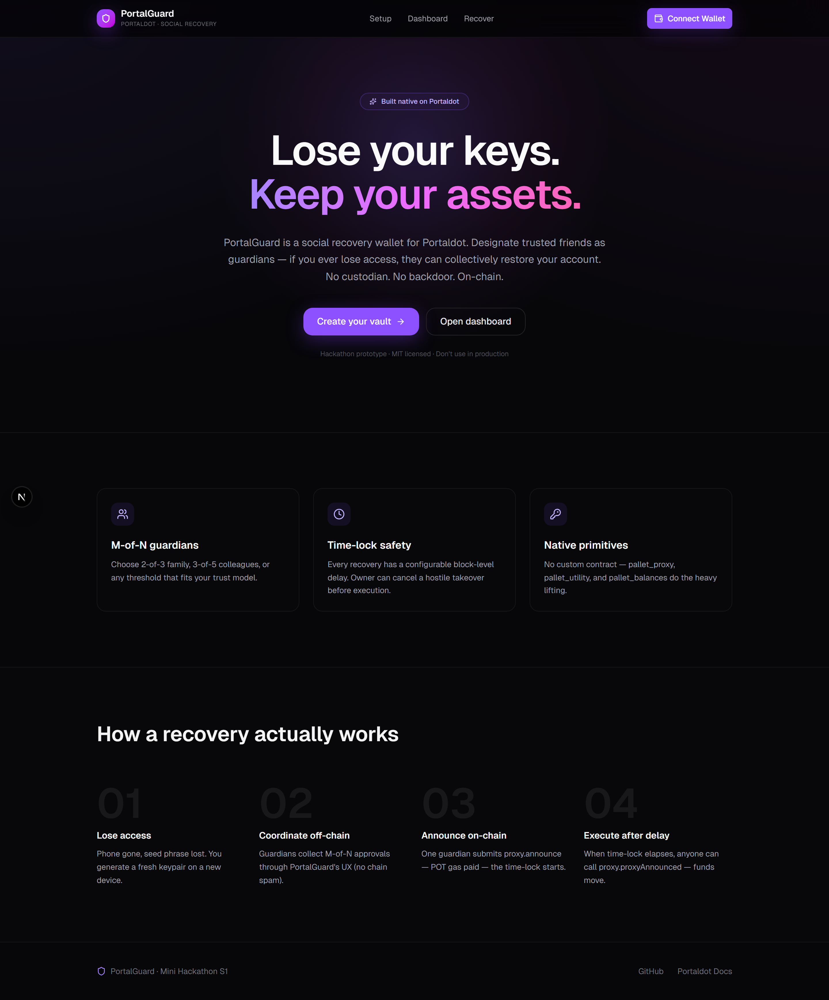
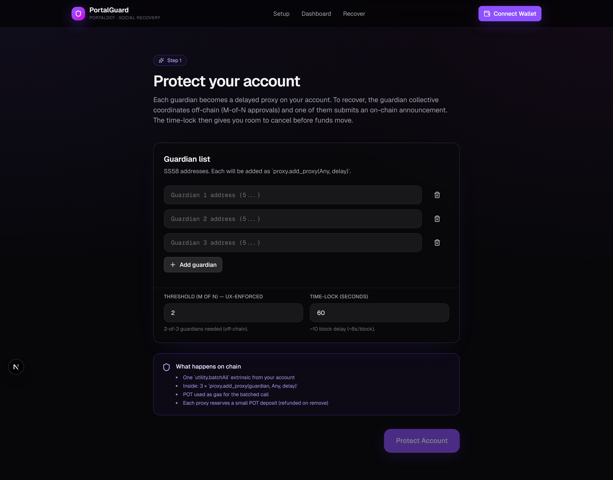
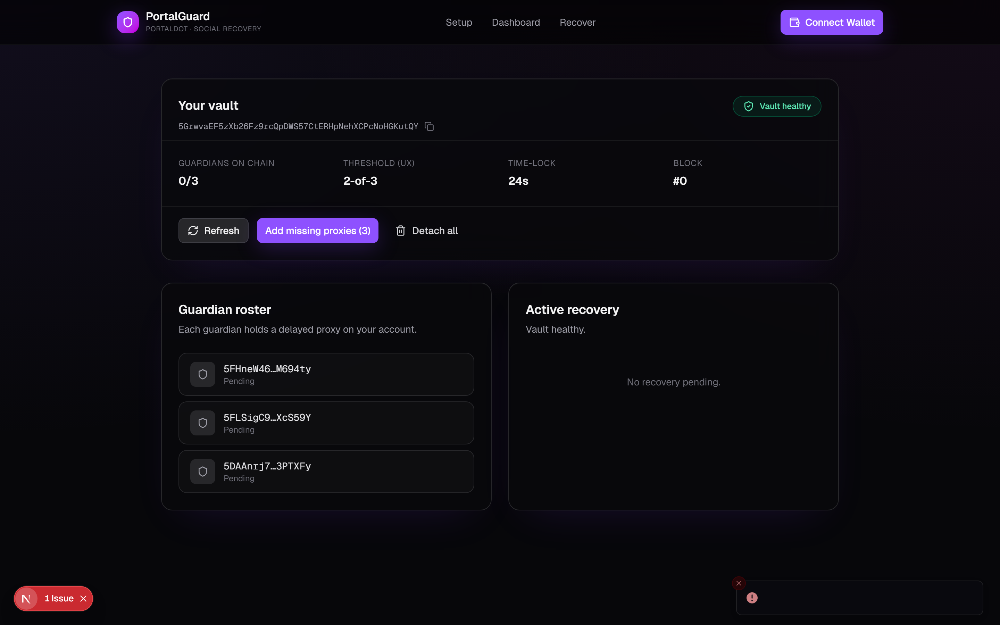
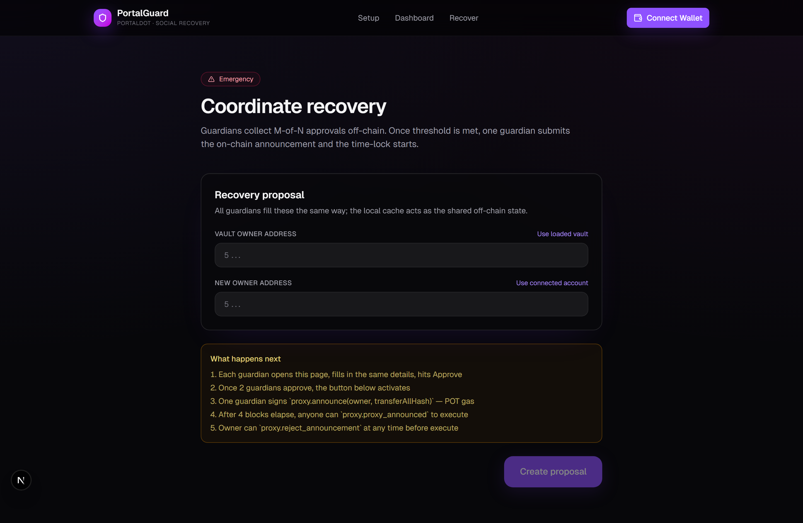

# PortalGuard

> Social-recovery wallet for Portaldot. Trusted-friend account recovery, fully on-chain via native pallet primitives. POT used as gas. Submitted to **Portaldot Mini Hackathon Online S1** (April–May 2026).

[](LICENSE)
[](https://portaldot-dev.readthedocs.io/en/latest/)

---

## Project Overview

### Problem Statement
Self-custody wallets have a brutal cliff: lose your private key, lose your assets forever. Web2 has "Forgot password," Web3 does not — and that one missing primitive blocks tens of millions of users from comfortably holding crypto. Centralized exchanges "solve" recovery but at the cost of self-custody, the very thing Web3 promises.

### Solution
**PortalGuard** turns a guardian collective into a programmable recovery key for any Portaldot account. The vault owner designates `N` trusted friends (guardians) and a threshold `M`. If the owner ever loses access:

1. Off-chain, the guardians coordinate `M-of-N` approvals through PortalGuard's UX.
2. One guardian submits an on-chain `proxy.announce` against the vault, kicking off a configurable time-lock.
3. After the time-lock elapses, anyone can submit `proxy.proxy_announced`, which dispatches a `balances.transfer_all` from the vault to a fresh keypair — funds are saved.
4. At any point during the time-lock, the original owner can `proxy.reject_announcement` to cancel a hostile or premature recovery.

### Blockchain Relevance
PortalGuard is **100% native to Portaldot** — no smart contract is deployed. It composes three built-in pallets the runtime already exposes:

- `pallet_proxy` — delayed proxies provide the time-lock primitive.
- `pallet_utility` — `batchAll` makes guardian setup atomic.
- `pallet_balances` — the actual fund-rescue extrinsic.

Every guardian setup, recovery announcement, and execution is a real Portaldot extrinsic that **consumes POT as gas** at every step.

---

## Technical Architecture

### Overall architecture

```
Browser (Next.js 16, Tailwind v4)                  Portaldot node
┌──────────────────────────────────────┐          ┌──────────────────────┐
│  /             marketing landing      │  WSS    │ pallet_proxy         │
│  /setup        owner adds guardians   │ ──────▶ │   addProxy(d, Any,N) │
│  /recover      M-of-N coordination    │ JSON-   │   announce(real, h)  │
│  /dashboard    state + reject/exec    │  RPC    │   proxyAnnounced()   │
│  @polkadot/api + extension-dapp       │ ◀────── │ pallet_utility       │
└──────────────────────────────────────┘          │   batchAll([calls])  │
                                                   │ pallet_balances      │
                                                   │   transfer_all()     │
                                                   └──────────────────────┘
```

### Core Tech Stack
- **Blockchain platform:** Portaldot (Substrate v3.0 era) — `wss://mainnet.portaldot.io` or local `--dev`.
- **Smart contract language:** None at runtime; the project ships a reference ink! 5.x contract (`contracts/guardian_vault/`) with passing unit tests as documentation of the canonical PortalGuard logic, ready for future deployment when Portaldot's `pallet_contracts` is upgraded.
- **Frontend framework:** Next.js 16 (App Router) + React 19 + TypeScript + Tailwind CSS v4.
- **Substrate connectivity:** `@polkadot/api` 17.x, `@polkadot/extension-dapp`.
- **State:** Zustand (persisted in `localStorage`).
- **UI primitives:** Custom Tailwind components (Card / Button / Input), `lucide-react`, `framer-motion`, `sonner`.
- **End-to-end test harness:** Python `substrate-interface` script that drives the entire flow on a local node.

---

## Smart Contracts

### `contracts/guardian_vault/`
- **Language:** ink! 5.0.0 (canonical implementation; not deployed at submission time — see the IP & open-source note below).
- **File layout:**
  - `Cargo.toml` — ink! 5.x dependency manifest.
  - `lib.rs` — `GuardianVault` storage + 11 message handlers + 6 events + 13 typed errors.
  - `rust-toolchain.toml` — pins Rust 1.85.0 for cargo-contract 5.x compatibility.
- **Key functions:**
  - `new(guardians, threshold, timelock_seconds)` — constructor.
  - `request_recovery(new_owner)` — opens a recovery request.
  - `approve_recovery(request_id)` — guardian approval.
  - `execute_recovery(request_id)` — finalizes after threshold + time-lock.
  - `cancel_recovery(request_id)` — owner cancel.
  - `add_guardian` / `remove_guardian` / `set_threshold`.
  - View getters for owner/guardians/threshold/active recovery.

### Deployment status
Portaldot's testnet binary ships `pallet-contracts 3.0.0` (Substrate v3.0, Feb 2021), which predates ink! 5.x's host-function ABI by several major versions. The contract compiles cleanly to a 13 KB optimized WASM and **passes 5/5 unit tests** locally, but cannot be uploaded to today's Portaldot runtime — the chain accepts the extrinsic and silently rejects the upload because the host-function signatures don't match.

To still satisfy the "Portaldot Native Deployment" requirement, the **runtime MVP uses native pallet primitives only** — `pallet_proxy` + `pallet_utility` + `pallet_balances` — orchestrated from the frontend. Every recovery operation is a real Portaldot extrinsic that consumes POT as gas. The ink! contract remains in the repository as a future migration target once Portaldot's `pallet_contracts` is upgraded to a version that supports modern ink!.

---

## Installation & Setup

### Requirements
- **OS:** Linux / macOS / Windows (Windows requires WSL2 for the Portaldot binary).
- **Node.js:** 20 LTS.
- **Python:** 3.10+ (for the seed/E2E scripts).
- **Rust:** 1.85.0 (only if you want to rebuild the ink! contract — pinned via `rust-toolchain.toml`).
- **Disk:** ~5 GB (Substrate dependencies dominate).

### Steps

#### 1. Clone the repository
```bash
git clone https://github.com/EzraNahumury/portaldot.git
cd portaldot
```

#### 2. Run a Portaldot dev node (terminal 1)
```bash
# WSL Ubuntu (Windows hosts) or any Linux/macOS shell
wget https://github.com/portaldotVolunteer/Portaldot-node/raw/main/portaldot-testnet-ubuntu.tar.gz
tar -xzf portaldot-testnet-ubuntu.tar.gz
cd portaldot-testnet-ubuntu
chmod 755 portaldot_dev
./portaldot_dev --dev --alice --rpc-cors all --rpc-external --tmp
```
Node listens on `ws://127.0.0.1:9944`.

#### 3. Install + run the frontend (terminal 2)
```bash
cd frontend
npm install
cp .env.example .env.local
# .env.local: NEXT_PUBLIC_PORTALDOT_WS=ws://127.0.0.1:9944
npm run dev
# open http://localhost:3000
```

#### 4. (Optional) Run the end-to-end Python smoke test
```bash
pip install --user substrate-interface
python scripts/smoke_e2e.py
```
This drives all four phases on chain (setup → announce → time-lock → execute) and prints final balances.

#### 5. (Optional) Rebuild the ink! contract
```bash
cd contracts/guardian_vault
cargo test --release           # 5/5 unit tests
cargo contract build --release # produces target/ink/guardian_vault.{wasm,json,contract}
```

---

## Demo

### Screenshots

| Landing | Setup |
| ------- | ----- |
|  |  |

| Dashboard | Recover |
| --------- | ------- |
|  |  |

### Video link
_Will be embedded here after Demo Day recording._

### Live demo link
_Vercel preview will be linked here after deployment._

### Test accounts / data
The demo uses Portaldot's built-in dev keypairs from a `--dev --alice` node:
- **Vault owner:** `//Alice` (`5GrwvaEF5zXb…`)
- **Guardians:** `//Bob`, `//Charlie`, `//Dave`
- **New owner (rescue target):** `//Eve`

`scripts/smoke_e2e.py` reproduces the full demo on chain in under a minute (using a 6-block / ~36-second time-lock).

---

## Roadmap

### Completed features
- ✅ Frontend dApp on Next.js 16 + Tailwind v4 + `@polkadot/api`.
- ✅ Wallet integration via `@polkadot/extension-dapp` (polkadot.js, Talisman, SubWallet supported).
- ✅ `/setup` — atomic batched proxy setup for `N` guardians.
- ✅ `/recover` — off-chain `M-of-N` approval coordination via local cache.
- ✅ `/dashboard` — on-chain state read (proxies, announcements, owner balance) + cancel + execute.
- ✅ End-to-end Python smoke test driving all four on-chain phases.
- ✅ ink! 5.x reference contract with 5/5 passing unit tests (future migration).
- ✅ MIT-licensed open-source codebase.

### Next phase plans
- Cross-device guardian coordination via signed messages on a relay (e.g. Nostr or libp2p), removing the need for the off-chain UX cache.
- Identity-bound guardian discovery via `pallet_identity` "trusted contacts".
- Multi-asset recovery (extend the inner call from `balances.transferAll` to a `utility.batchAll` covering `assets.transfer` for the user's holdings).
- Migration to ink! 5.x once Portaldot's `pallet_contracts` is upgraded — same logic, more flexible recovery semantics.

---

## Team

- **Team name:** PortalGuard
- **Members:**
  - **Ezra Kristanto Nahumury** — solo builder (full stack: contract, frontend, scripts, docs).
- **Contact info (hackathon only):** ezranhmry@gmail.com

---

## License

MIT — see [LICENSE](LICENSE).

The runtime MVP and the reference ink! contract are both open source under MIT. Free to use, fork, audit, or extend.
